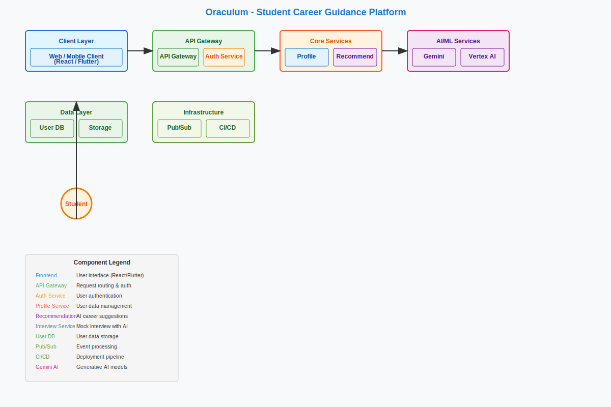

# Oraculum Architecture - Usage Guide

## Quick Start Options

### Option 1: Online Rendering (Easiest)
1. Open https://www.plantuml.com/plantuml/uml/
2. Copy the entire content from `oraculum-architecture.puml`
3. Paste into the editor
4. Download as SVG, PNG, or PDF

### Option 2: Use Pre-made SVG
1. Open `oraculum-architecture-manual.svg` in any browser
2. Right-click  Save image as  Choose format
3. Insert into your presentation

### Option 3: Local Rendering (Most Control)
1. Install Java and Graphviz (see commands above)
2. Run: `java -jar plantuml.jar -tpng oraculum-architecture.puml`
3. Use the generated PNG file

## Presentation Integration

### PowerPoint/Google Slides
1. Insert the SVG or PNG image
2. Copy bullet points from `oraculum-slide-content.md`
3. Use the "How It Works" paragraph as speaker notes

### Web Applications
```html

```

### Documentation
```markdown


## Component Overview
[Copy content from oraculum-slide-content.md]
```

## File Formats Available
- **PlantUML Source**: Editable, version-controlled
- **SVG**: Scalable, perfect for presentations
- **PNG**: Raster image, universal compatibility
- **PDF**: Print-ready, professional documents

## Customization
- Edit `oraculum-architecture.puml` to modify the diagram
- Re-render using PlantUML to update all formats
- Adjust colors, layout, or add new components as needed
